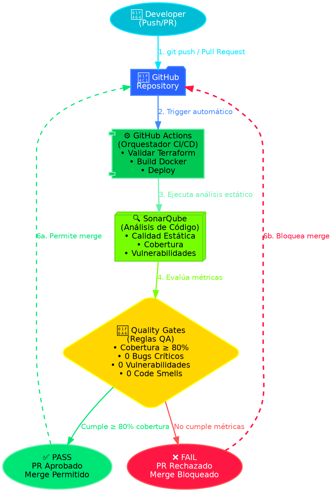

# 🛡️ SonarQube QA Infrastructure

Infraestructura como Código (IaC) para desplegar **SonarQube Community Edition** con **PostgreSQL**, orquestado por **GitHub Actions** y configurado con **Quality Gates** automatizados.

---

## 🏗️ Arquitectura



---

## 🚀 Inicio Rápido

### Opción 1: Docker Compose (Local)

```bash
cd docker
docker-compose up -d
# Acceder: http://localhost:9000
# Credenciales por defecto: admin / admin
```

### Opción 2: Terraform (Local)

```bash
cd terraform
terraform init
terraform plan -var="db_password=sonar"
terraform apply -var="db_password=sonar"
```

---

## 📁 Estructura del Proyecto

```
sonarqube-qa-infrastructure/
├── .github/workflows/     # Pipelines CI/CD de GitHub Actions
├── docker/               # Dockerfile y docker-compose
├── terraform/            # IaC - Módulos y configuración
├── docs/                 # Documentación técnica
├── .gitignore            # Archivos ignorados por Git
└── README.md             # Este archivo
```

---

## 🔧 Componentes

### 🐳 Docker
- **SonarQube**: Community Edition 10.6
- **PostgreSQL**: Base de datos 15-alpine

### 🏗️ Terraform
- Provider: kreuzwerker/docker
- Módulos: sonarqube (contenedores, redes, volúmenes)

### ⚙️ GitHub Actions
1. **validate-infra**: Valida configuración Terraform
2. **build-and-scan**: Build Docker + Trivy security scan
3. **deploy**: Aplica cambios de infraestructura
4. **configure-quality-gates**: Configura reglas QA

---

## 📖 Documentación

- [Guía de Despliegue](./docs/deployment-guide.md)
- [Configuración de Quality Gates](./docs/quality-gates.md)
- [Pipeline CI/CD](./docs/cicd-pipeline.md)

---

## 🧪 Comandos Útiles

```bash
# Levantar servicios
docker-compose -f docker/docker-compose.yml up -d

# Ver estado
docker-compose -f docker/docker-compose.yml ps

# Ver logs
docker-compose -f docker/docker-compose.yml logs -f sonarqube

# Detener servicios
docker-compose -f docker/docker-compose.yml down

# Validar Terraform
cd terraform && terraform validate

# Destruir infraestructura
cd terraform && terraform destroy -var="db_password=sonar"
```

---

## 🔐 Variables de Entorno

### Terraform (Local)
```bash
export TF_VAR_db_password="sonar"
export TF_VAR_environment="dev"
```

### Secretos GitHub (Repositorio)
| Secreto | Descripción |
|---------|-------------|
| `SONAR_HOST_URL` | URL de SonarQube (http://localhost:9000) |
| `SONAR_TOKEN` | Token de SonarQube (generar en: My Account → Security) |
| `DB_PASSWORD` | Password de PostgreSQL |

---

## 🎯 Quality Gates Configurados

| Métrica | Condición | Descripción |
|---------|-----------|-------------|
| Coverage | < 80% | Cobertura de código mínima |
| blocker_violations | > 0 | Bugs bloqueantes |
| vulnerabilities | > 0 | Vulnerabilidades de seguridad |
| critical_violations | > 0 | Code smells críticos |

---

## 📝 Licencia

GPL-3.0 - Ver LICENSE para más detalles.

---

**Grupo G2 - QA Framework Demo**  
🏫 Universidad Centroamericana (UCE)  
📅 Semestre 2026